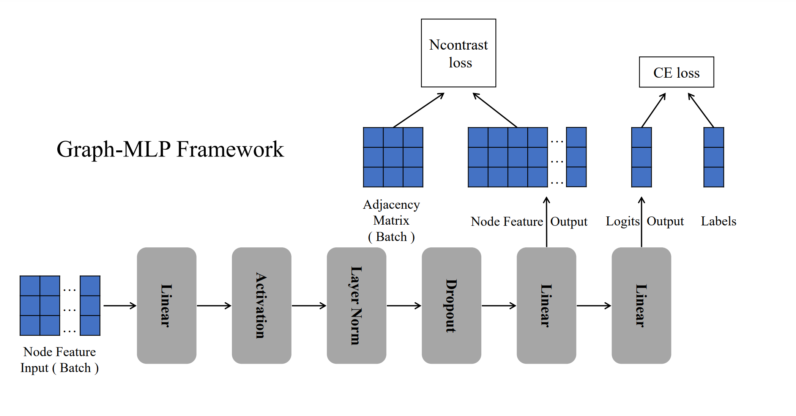
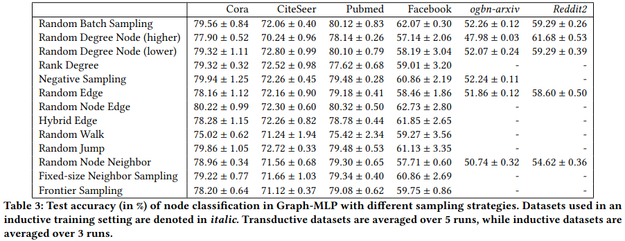

# Graph-MLP Sampling Extension

> IMPORTANT: This is a fork of [Graph-MLP](https://github.com/yanghu819/Graph-MLP) in which we add new sampling strategies and other datasets.

PyTorch official implementation of *Graph-MLP: Node Classification without Message Passing in Graph*.
For details on the original Graph-MLP, please refer to the paper: https://arxiv.org/abs/2106.04051 






## Structure

* **data**
  * Contains the computed adjacency matrices and node degree values.
* **dataset**
  * Contains the raw and processed data of the used datasets.
* **run-scripts**
  * All run scripts (calc-adj-*.sh are used to calculate the adjacency matrix with out further running the Graph-MLP pipeline)
* **train.py**
  * Main Python file that manages Graph-MLP 
* **sample.py**
  * Sampling methods implemented by us


## Requirements

  * PyTorch **1.7**
  * Python **3.7**

## Installation
First, create a new virtual environment or use your global one and install PyTorch and PyTorch-Geometric (PyG).

Install the correct **PyTorch** version for your system from [the official website](https://pytorch.org/get-started/locally/).
Then install the corresponding **PyG** version (correct PyTorch version and same CUDA version) from [here](https://pytorch-geometric.readthedocs.io/en/latest/install/installation.html).

After this is done install the remaining requirements from the `requirements.txt` by running:
```shell
pip install -r requirements.txt
```

### WandB
Our implementation uses [Weights & Biases](https://wandb.ai/site) to easily track your runs.
To change the entity (personal or team account) and the project, change the variables at the top of [train.py](../train.py).
To disable logging in a run, add the `--no-wandb` flag.

To track runs you have to log in to WandB on your device. To do this activate the virtual environment and run 
```
wandb login
```

## Datasets
This is a list of datasets implemented in this extension. For the `--data` argument use the name in parentheses.
- [Cora](https://link.springer.com/article/10.1023/A:1009953814988) (`cora`), [CiteSeer](https://dl.acm.org/doi/10.1145/276675.276685) (`citeseer`), [Pubmed](https://ojs.aaai.org//index.php/aimagazine/article/view/2157) (`pubmed`): Citation networks, commonly used for a node classification baseline.
- [OGBN-arxiv](https://ogb.stanford.edu/docs/nodeprop/#ogbn-arxiv) (`ogbn-arxiv`): A large citation network based on papers from arxiv from 2017 to 2019.
- [OGBN-products](https://ogb.stanford.edu/docs/nodeprop/#ogbn-products) (`ogbn-products`): A co-purchasing network for Amazon products.
- [Reddit2](https://openreview.net/forum?id=BJe8pkHFwS) (`reddit2`): A condensed network of Reddit-posts connected by an overlapping commenter.
- [FacebookPagePage](https://academic.oup.com/comnet/article/9/2/cnab014/6271062) (`facebook`): A network of official Facebook pages connected by mutual likes.

> Note: OGBN-arxiv, OGBN-products and Reddit2 have many nodes. Make sure you have enough resources to run Graph-MLP on these datasets. See the table below for more information.

|          |  Cora | CiteSeer | Pubmed | ogbn-arxiv | ogbn-products |    Reddit2 | Facebook |
|---------:|------:|---------:|-------:|-----------:|--------------:|-----------:|---------:|
|    Nodes | 2,708 |    3,327 | 19,717 |    169,343 |     2,449,029 |    232,965 |   22,470 |
|    Edges | 5,429 |    4,732 | 44,338 |  1,166,243 |    61,859,140 | 23,213,838 |  171,002 |
|  Classes |     7 |        6 |      3 |         40 |            47 |         41 |        4 |
| Features | 1,433 |    3,703 |    500 |        128 |           100 |        602 |   14,000 |


## Samplers
See [supplementary-information/Sampling.md](supplementary-information/Sampling.md).

## Usage

```
## cora
python3 train.py --data=cora --epochs=400 --hidden=256 --dropout=0.6 --lr=0.001 --weight_decay=5e-3 --alpha=100.0 --batch_size=2000 --order=3 --tau=2 --sampler=random_batch

## citeseer
python3 train.py --data=citeseer --epochs=400 --hidden=256 --dropout=0.6 --lr=0.01 --weight_decay=5e-3 --alpha=1.0 --batch_size=2000 --order=2 --tau=1 --sampler=random_batch

## pubmed
python3 train.py --data=pubmed --epochs=400 --hidden=256 --dropout=0.6 --lr=0.001 --weight_decay=5e-3 --alpha=1.0 --batch_size=3000 --order=3 --tau=2 --sampler=random_batch

## FacebookPagePage
python3 train.py --data=facebook --epochs=400 --hidden=256 --dropout=0.6 --lr=0.001 --weight_decay=5e-4 --alpha=1.0 --batch_size=2000 --order=4 --tau=0.5 --sampler=random_batch

## ogbn-arxiv
python3 train.py --data=ogbn-arxiv --epochs=400 --hidden=2048 --dropout=0.15 --lr=0.001 --weight_decay=0 --alpha=30.0 --batch_size=7000 --order=3 --tau=15 --sampler=random_batch

## Reddit2
python3 train.py --data=reddit2 --epochs=400 --hidden=2048 --dropout=0.15 --lr=0.001 --weight_decay=0 --alpha=30.0 --batch_size=7000 --order=2 --tau=15 --sampler=random_batch
```
or

```
## Run all samplers on <dataset> ('cora', 'citeseer', 'pubmed', 'facebook')
bash run.sh <dataset>
```

```
## Run <sampler> on ogbn-arxiv, see supplementary-information/Sampling.md
bash run-arxiv.sh <sampler>
```
```
## Run <sampler> on Reddit2, see supplementary-information/Sampling.md
bash run-reddit.sh <sampler>
```

When new experiment is finished, the new result will also be appended to log.txt.

We also provide a tutorial to run our experiment on the [BwUniCluster2.0](https://www.scc.kit.edu/en/services/bwUniCluster_2.0.php) (see [Unicluster.md](supplementary-information/Unicluster.md)). The run scripts mentioned above also contain the necessary slurm definitions.

## Cite

As this repository only extends Graph-MLP, please still cite the original paper if you use this code in your own work:

```
@misc{hu2021graphmlp,
      title={Graph-MLP: Node Classification without Message Passing in Graph}, 
      author={Yang Hu and Haoxuan You and Zhecan Wang and Zhicheng Wang and Erjin Zhou and Yue Gao},
      year={2021},
      eprint={2106.04051},
      archivePrefix={arXiv},
      primaryClass={cs.LG}
}
```
